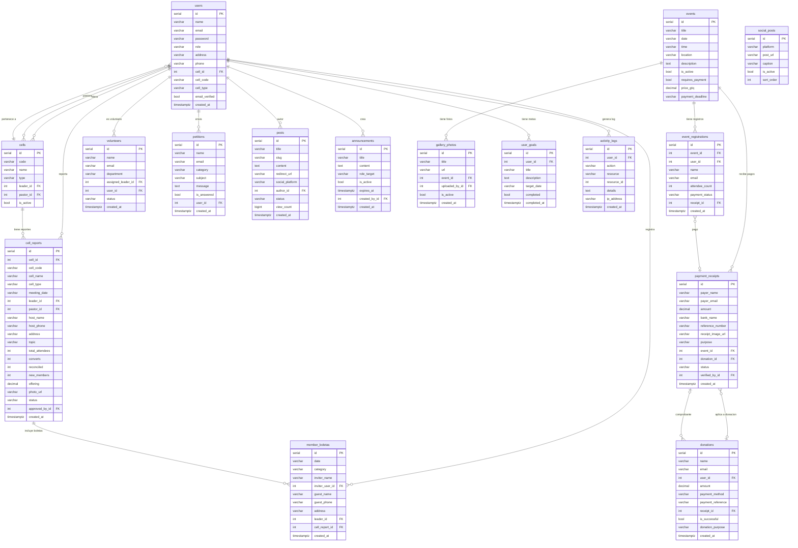

# ERD — Casa del Rey

---

## Leyenda de campos nuevos (Fase 1)

| Campo | Tabla | Descripción |
|---|---|---|
| `phone` | users | Teléfono del usuario |
| `cell_id` | users | FK a tabla cells (reemplaza cell_code/cell_type) |
| `time` | events | Hora del evento |
| `requires_payment` | events | Si requiere pago para inscribirse |
| `price_gtq` | events | Precio en quetzales |
| `payment_deadline` | events | Fecha límite de pago |
| `payment_status` | event_registrations | Estado del pago |
| `receipt_id` | event_registrations | FK al comprobante bancario |
| `user_id` | donations | FK al usuario si es miembro |
| `receipt_id` | donations | FK al comprobante |
| `inviter_user_id` | member_boletas | FK si el invitador es miembro |
| `pastor_id` | cell_reports | FK al pastor (reemplaza pastor_name) |
| `cell_id` | cell_reports | FK a tabla cells |
| `user_id` | volunteers | FK al usuario creado |
| `user_id` | petitions | FK al líder que envía |
| `social_platform` | posts | Plataforma del redirect_url |
| `expires_at` | announcements | Auto-expiración del anuncio |
| `completed_at` | user_goals | Timestamp de completado |

## Tablas nuevas

| Tabla | Propósito |
|---|---|
| `cells` | Normaliza las células (evita strings repetidos en cell_reports y users) |
| `payment_receipts` | Verifica comprobantes bancarios para pagos de eventos y donaciones |

## Tabla a eliminar

| Tabla | Razón |
|---|---|
| `paypal_orders` | PayPal fue removido del sistema en mayo 2026 |
